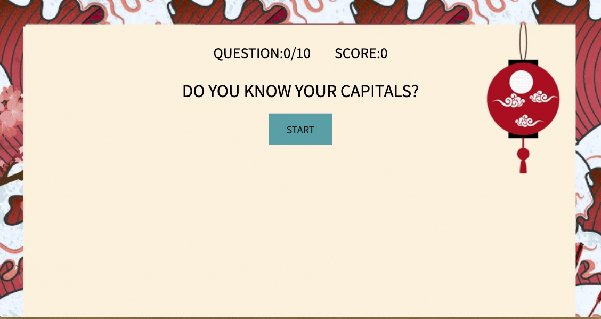

https://github.com/vbc221/Triva-app-.wiki.git
Description:
Created a quiz app that tests your knowledge on capitals of different countries. Quiz contains 10 questions and tracks your correct and wrong answers throughout the quiz. 

Brief Example:

List of Features / User Stories
This typically will be a short list of the features / user stories that you planned during the development phase of the project
To provide more detail, you can show how you categorized these features into Bronze (MVP), Silver, and Gold Levels and indicate which features you complete / have yet to complete

List of Technologies Used
Often you will want to list the technologies you used to create the project.
This typically would consist of all primary languages, frameworks, and libraries your app is composed of
This is particularly important when it comes to recruiters scanning your projects for keywords

Installation Instructions / Getting Started
This section should walk a reader, step by step, through the process of setting up your project
For a tool meant to be integrated into other projects, this would likely outline the process of installing and accessing this tool in your project
For an application, this would likely outline the process of forking, cloning, and starting the app locally
